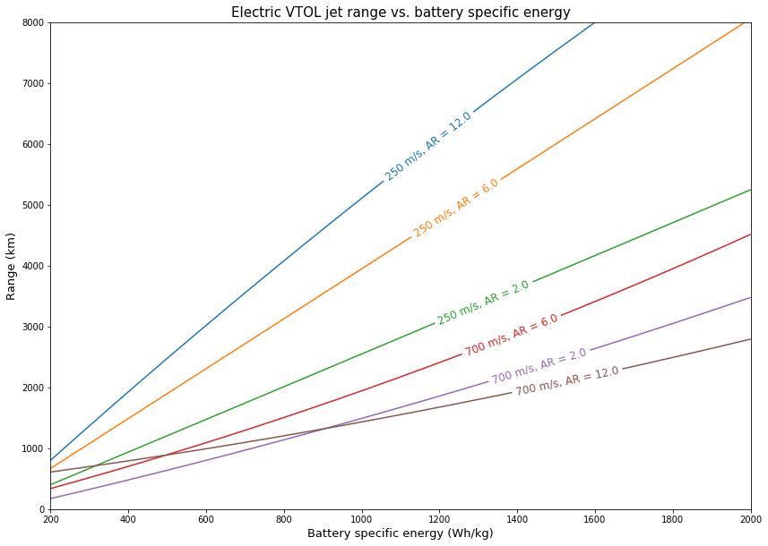

# Electric supersonic VTOL jet exploration

The goal of this notebook is to explore a supersonic VTOL electric jet. By building a drag model and using different assumptions, we can explore what such an airplane might look like, and analyze what its range would be given different batteries and wing layouts. See [Elon Musk's thoughts](https://www.youtube.com/watch?v=RyS92KPQnjk) on electric jets.

### Aircraft layout

The aircraft could either be a conventional design (with a separate fuselage and wing) or a [blended wing body](https://en.wikipedia.org/wiki/Blended_wing_body). There would be many fans embedded in the wing that can be used for VTOL. A tail is not needed; the combination of swept wing tips and distributed propulsion would provide adequate control. The fuselage length is set equal to the "total" chord of the wing (from root leading edge to wingtip trailing edge).

### VTOL

Many small motors and fans could be used to provide improved reliability ([distributed propulsion](https://en.wikipedia.org/wiki/Distributed_propulsion)). Distributed electric propulsion enables VTOL, which eliminates the need for extremely large airport runways.

During takeoff and landing, electric motors can run for short periods of time at a higher than nominal power. This would reduce the mass requirement of the motors required for VTOL. The primary engines, if they were able to gimbal, would also contribute vertical lift.

### Flight engines

The propulsion is assumed to be, effectively, electric compressors connected to a nozzle. Air is decelerated in an inlet which raises the pressure. A multi-stage axial compressor further raises the pressure, and the air is accelerated out of a nozzle (converging nozzle for subsonic flow, or converging-diverging nozzle for supersonic flow). The engines would be positioned along the trailing edge of the wing.

Like the VTOL system, many smaller engines can be used to provide improved reliability. [Boundary layer ingestion](https://en.wikipedia.org/wiki/Boundary_layer#Boundary_layer_ingestion) may be feasible if many smaller engines (with smaller compressor diameters) are embedded in the trailing edge of the aircraft.

## Model

We build a drag model in this notebook that allows us to compute the drag of an aircraft with different paramters (wing area, aspect ratio, lift requirement, and so on). The drag model is based on the [incredible work of the late R.T. Jones](https://ntrs.nasa.gov/archive/nasa/casi.ntrs.nasa.gov/19760011971.pdf).

The aircraft structural model is very simple: we simply assume a fixed mass of the aircraft (80% in this case) is used for batteries. 80% may seem high, but rockets often have a [propellant mass fraction](https://en.wikipedia.org/wiki/Propellant_mass_fraction) greater than 80%! Batteries allow us to do this more easily than fuel because batteries have a much higher density (2.5x) than rocket fuel, so the constraint would mostly be mass instead of volume.

The propulsion model is also very simple: we assume that the main engines have a total efficiency of 72% and the VTOL fans have a total efficiency of 1%. While the VTOL efficiency may seem very low, remember that this is the total efficiency of converting the electrical energy in the batteries to gravitational potential energy. The majority of the energy is used for hovering and only a small proportion is used for movement.

There are four stages of flight in the model: ascent, cruise, descent, and reserve. The reserve stage does not contribute to the total flight distance as it should only be used in emergencies.

### Optimization

Different parameters can be fed into the model to generate different aircraft performance. Here are all the parameters (SI units are used): battery_mass, wing_area, sweep_angle, climb_duration, climb_power, climb_airspeed, cruise_duration, cruise_power, descent_duration, descent_power, descent_airspeed, reserve_power, reserve_airspeed, battery_specific_energy, cruise_airspeed, and aspect_ratio.

All of these parameters are allowed to vary within the optimization except for [battery specific energy](https://en.wikipedia.org/wiki/Specific_energy), [cruise airspeed](https://en.wikipedia.org/wiki/True_airspeed), and [aspect ratio](https://en.wikipedia.org/wiki/Aspect_ratio_(aeronautics)), which are fixed. Using various values for these fixed parameters, we can optimize the remaining parameters to find the optimal aircraft at different fixed parameter values.

Differential evolution (from [scipy](https://docs.scipy.org/doc/scipy/reference/generated/scipy.optimize.differential_evolution.html)) is used as the optimization technique to maximize aircraft range over the floating variables.

After optimizing different aircraft, we regress the range versus battery specific energy for different aspect ratios and airspeeds. This lets us see the required battery specific energy needed to achieve a given range at different aspect ratios and airspeeds. Since battery specific energy is projected to grow around 5-10% per year, we could use this to predict when a VTOL electric jet (both subsonic and supersonic) will be viable.

# Results
Range (km) vs. battery specific energy (Wh/kg) is plotted for subsonic (250 m/s) and supersonic (700 m/s) airspeeds and various aspect ratios. The complete model and calculations [can be found in the notebook](https://github.com/gusgordon/electric_jet/blob/master/plane.ipynb).

With current batteries, which are around 300 Wh/kg, we can achieve around a 1400 km range with a low airspeed, high aspect ratio aircraft under our assumptions. As expected, we find lower airspeeds and higher aspect ratios lead to better results.

It is clear that subsonic (250 m/s) electric aircraft will be viable before supersonic (700 m/s) electric aircraft. Supersonic VTOL electric aircraft may become viable somewhere around a battery specific energy of 1500 Wh/kg.

The lower range of the 700 m/s aircraft with an aspect ratio of 12 shows that increasing aspect ratio only helps up to a point in supersonic flight. [This answer](https://aviation.stackexchange.com/questions/36761/why-does-the-aspect-ratio-of-a-wing-become-less-important-at-supersonic-speeds) gives an overview of why that is the case. In supersonic flight, the large aspect ratio wing has a higher range for lower battery specific energies because the aircraft spends proportionally more time in subsonic ascent/descent where having a higher aspect ratio wing is helpful.
